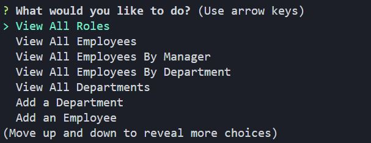

## Employee Tracker

Description

- Employee tracker is an easy way to keep up with your employees. Keep track of their salaries, departments and roles, with a simple UI to let you add and update those fields as well.

Walkthrough Video: https://drive.google.com/file/d/1hlWFMNdTM_qROwRSEGFQ1PjouLHszLJO/view

How to use software:

- Install all requirements
- Run node index.js to launch the app
- Follow the instructions!

Built with
- Node
- Inquirer
- MySQL

Screenshots:
)

Made by Alex Chen